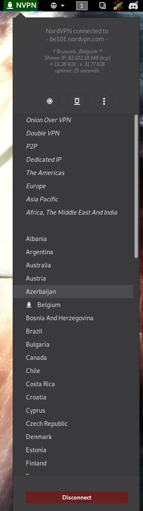
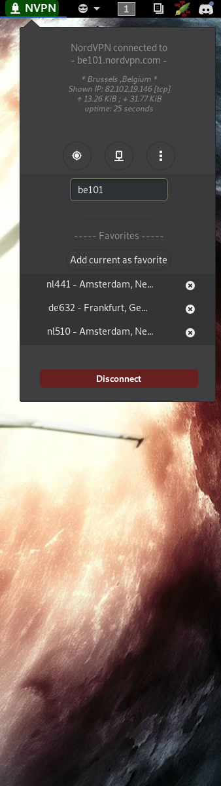
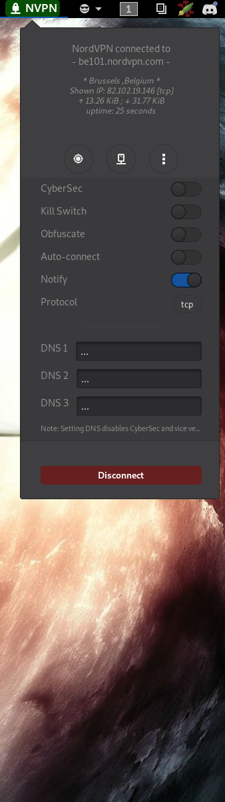

# README:

'NordVPN Connect' gnome-shell extension.

The natural basic necessary step before using this GNOME-Shell extension is, of course, to read this README in its entirety.

   

## About

This extension acts merely and only as a simple GUI for the 'nordvpn' command
line tool basic features that are connection and disconnection to a vpn server.
It also provides basic info about the current status of said connection: whether
or not there is connection and, if so, to which server.
Of course, this requires the 'nordvpn' command line tool, and all necessary
dependencies and requirements to be installed as well. To that effect check out
NordVPN's corresponding page: https://nordvpn.com/download/linux/

Ultimately, this extension should be replaced by any GUI app, NordVPN might officially release for Linux desktop.

###### ToDo?

On the off chance, such GUI app isn't released for Linux in the near future. Some welcome ameliorations to this extension would be:

- [x] Add more of the 'nordvpn' CLI tool features in this extension such as an 'AutoConnect' toggle, a protocol (UDP/TCP) picked and a 'CyberSec' feature toggle.
- [x] Add a 'settings' page for this extension.
- [x] Add the possibility to type in the name of the server (e.g.: de145, uk123, fr067) the user wants to connect to.
- [ ] Add the possibility to pick server by choosing a city (instead of country).
- [x] Add the remaining *set custom DNS* feature to the extension.
- [x] Add the possibility to 'fav' a server

## Disclaimer

###### Nothing official

This extension has been made **without any endorsement or support from NordVPN.**
The developer has no ties nor affiliation whatsoever with NordVPN, its
services, nor its software.
Naturally, this extension is free and isn't, shouldn't and will **not be
subject to any form of profit or compensation**.

###### Release and use

This extension was made for personal needs and use. The code is release on the
off chance it might be of use to someone but without the intention of providing
any form of utility software or service in a rigorous manner.
Therefore, **no support** is endorsed by the developer, meaning that **any
comment, feedback, or request regarding this code should be expected to be completely
ignored by the developer**.
Additionally, the responsibility of any undesired effect the execution of this
code might have on any system lies solely in the hands of the user.

###### Availability

This extension is available in the AUR: https://aur.archlinux.org/packages/gnome-shell-extension-nordvpn-connect-git/

It is also available via the *“ GNOME Extensions ”* website: https://extensions.gnome.org/extension/1595/nordvpn-connect/

However, the most up-to-date version is only guaranteed here, on GitHub.

## Installation

###### Prerequisites

Since this is only a GNOME-Shell GUI for the 'nordvpn' command line tool, said
tool must be installed before anything else. This extension is destined for
**systemd distributions only!**

If you're on a debian based distribution, checkout this page: https://nordvpn.com/download/linux/

If you're on an archlinux based distribution, this tool *might* be available in
the AUR: https://aur.archlinux.org/packages/nordvpn-bin/

Once the 'nordvpn' CLI tool is installed (assuming here, version `3.0.0`), check the packaged daemon's status:

    systemctl status nordvpnsd.service
    systemctl --user status nordvpnud.service
    
If the daemon isn't up and running, fix that:

    systemctl enable --now nordvpnsd.service
    systemctl --user enable --now nordvpnud.service
    
Now, set up your logins to the NordVPN service:

	nordvpn login
    
Now you should be able to use this extension.

###### Test

This tool has been tested on '*Archlinux*', with '*GNOME Shell 3.30.2*' and the *'nordvpn' CLI tool version 2.1.0-5*, for all commits before (and including) commit `a0c1b1034e0a8518796e5490a4a8746fa20da506` (revert to this commit if encountering compatibility issues).

This tool has been tested on '*Archlinux*', with '*GNOME Shell 3.32.0*' and the *'nordvpn' CLI tool version 2.2.0-2*, for commits before (and including) commit *cf7538c5bfe7a09547c2d5e87bfd1952538a2581*.

This tool has been tested on '*Archlinux*', with 'GNOME Shell 3.32.1' and the *'nordvpn' CLI tool version 3.0.0-4*, for later commits.

###### Install

If you've cloned or downloaded this extension from github, copy the content of its root directory to a new directory: `~/.local/share/gnome-shell/extensions/NordVPN_Connect@poilrouge.fr`.

Then, activate the extension (if needed).

From the start, a command line install should look like this:

`git clone https://github.com/AlexPoilrouge/NordVPN-connect.git`

`mkdir ~/.local/share/gnome-shell/extensions/NordVPN_Connect@poilrouge.fr`

`cp NordVPN-connect/* ~/.local/share/gnome-shell/extensions/NordVPN_Connect@poilrouge.fr/`

( May not be necessary ):

`gnome-shell-extension-tool -e NordVPN_Connect@poilrouge.fr`

## Misc.

###### Extension settings page

Since commit `aabdf8d307c1ecebf38c097b9e34987862ae859b`, an *“ Extension Settings ”* page has been added.

Like all other Gnome-shell extension (that provides shuch 'settings' page), there are several ways of accessing it:

1. Install and use the *“ gnome-tweaks ”* tool. Then go to the `Extensions` tab. From there you should be able to access to extensions settings page, if there are any provided with corresponding extension.
2. Go to the *“ GNOME Extensions ”* website, and visit the [*“ Installed Extensions ”* section](https://extensions.gnome.org/local/). From there you should be able to manage your installed extensions, provided your web browser had the *“ GNOME Shell Integration ”* plugin installed and enabled.
3. Your Gnome environment *might* have been provided with the `gnome-shell-extension-prefs` tool. Invoke it from a terminal to manage your extensions.

## Help

***The extension says « tool not found. », Holly Cow!***

  This probably means that the 'nordvpn' CLI tool is either not installed, either not found by the system. See previous section for installation and the NordVPN website ( https://nordvpn.com/download/linux/ ).

***The extension says « daemon disabled/missing », what gives?***

  Installing the 'nordvpn' CLI tool isn't enough. The 'nordvpnd' systemd daemon must be up and running. Open a terminal and type:
  
    systemd enable --now nordvpnsd.service
    systemd --user enable --now nordvpnud.service

***The extension says « tool not logged in », what's up?***

  You probably haven't set up your logins to the 'nordvpn' CLI tool. Open a terminal and type:
  
    nordvpn login
    
and enter your NordVPN logins.

***The extension seems to be blocked in some sort of “ waiting state ”.***

  This extension is supposed to react to the current state of the NordVPN server connection given by the 'nordvpn' CLI tool and the 'nordvpnd' systemd daemon. Therefore, you might need to use those tool to fix the issue.

***-> Once you made the appropriate change, either reload the extension, or reload gnome shell by using `Alt+F2` and entering `r`***

***I have a custom installation of 'nordvpn' CLI tool / I don't use 'systemd' / whatever … Am I doomed?***

  Pretty much. Howerver, since commit `aabdf8d307c1ecebf38c097b9e34987862ae859b`, a *“ Settings ”* page has been added to the extensions. I contains a tab that allows you to change the core shell commands that allows to monitor and connect with the *nordvpn* CLI tool. But you're on your own from there, sorry.

***Yo, the extension say's there's a pickle with my 'shell' or something… Da fox?***

  This extension, by default, uses `bash` to run its core commands. The default path it uses is `/bin/bash`. However, if that doesn't fit with your install, you can try changing the default shell within the "*Advanced*" tab, located in the extensions '*[settings](#extension-settings-page)*' page (only possible since commit `28bbe2bb0178c8e6325683585b5268fa454798a0`, i.e. version 7 of the extension).

***

*From Strasbourg, with love.*

Alex Poilrouge
